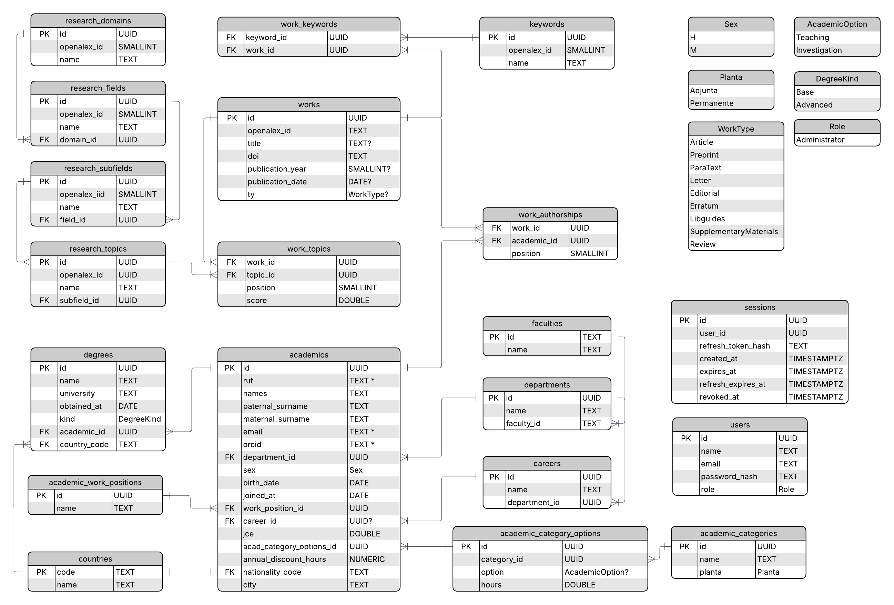

# Plataforma de Visualización y Gestión de Investigación (ORCID-ACAD-MGR)

## Resumen del Proyecto

Actualmente la universidad gestiona la información de publicaciones académicas mediante planillas Excel. El objetivo de este proyecto es construir una plataforma que permita:

- Importar investigadores y publicaciones desde ORCID.
- Mantener una clasificación institucional propia.
- Generar dashboards y estadísticas.
- Disponer de una vista pública y una vista administrativa.
- Facilitar el análisis de la producción científica de la universidad.

---

## PostgresDB Entity Relationship Diagram (ERD)

---

## Categorías y Opciones Academicas

### Categorías Academicas por Planta

| Planta     | Categoría             |
|------------|-----------------------|
| Permanente | Profesor Titular      |
| Permanente | Profesor Asociado     |
| Permanente | Profesor Asistente    |
| Permanente | Profesor Instructor   |
| Permanente | Doctor Joven          |
| Permanente | Sin Categorizar       |
| Adjunta    | Profesor Adjunto      |
| Adjunta    | Instructor Adjunto    |
| Adjunta    | Investigador Adjunto  |

### Opciones validas por categoría

| Categoría            | Docencia | Investigación |
|----------------------|----------|---------------|
| Profesor Titular     | ✅       | ✅            |
| Profesor Asociado    | ✅       | ✅            |
| Profesor Asistente   | ✅       | ✅            |
| Profesor Instructor  | ✅       | ❌            |
| Doctor Joven         | ✅       | ❌            |
| Sin Categorizar      | ✅       | ❌            |
| Profesor Adjunto     | ✅       | ❌            |
| Instructor Adjunto   | ✅       | ❌            |
| Investigador Adjunto | ✅       | ❌            |
